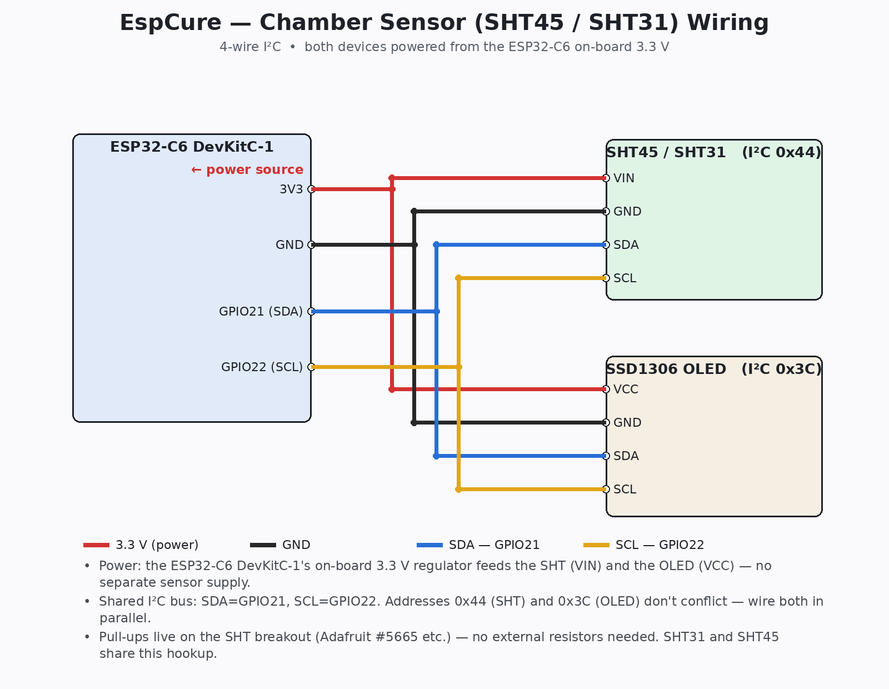
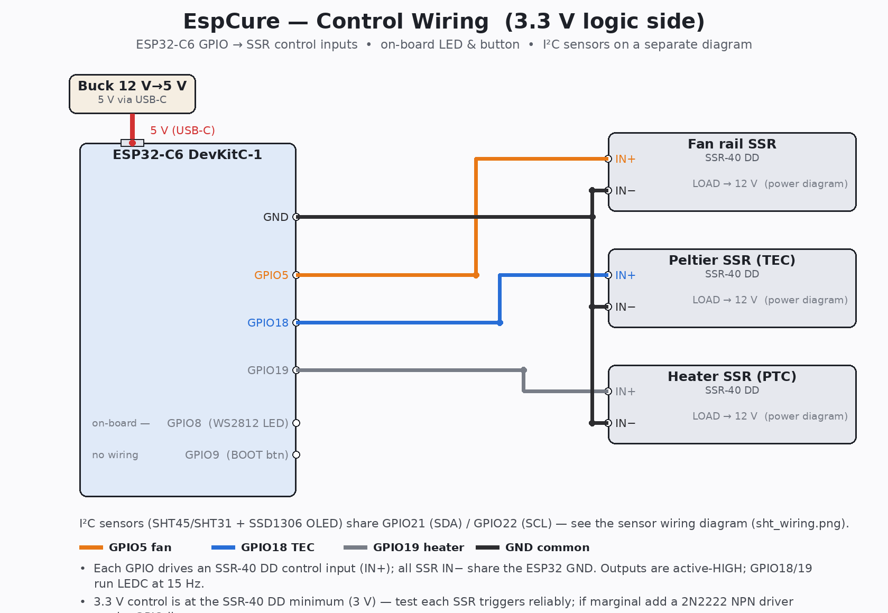
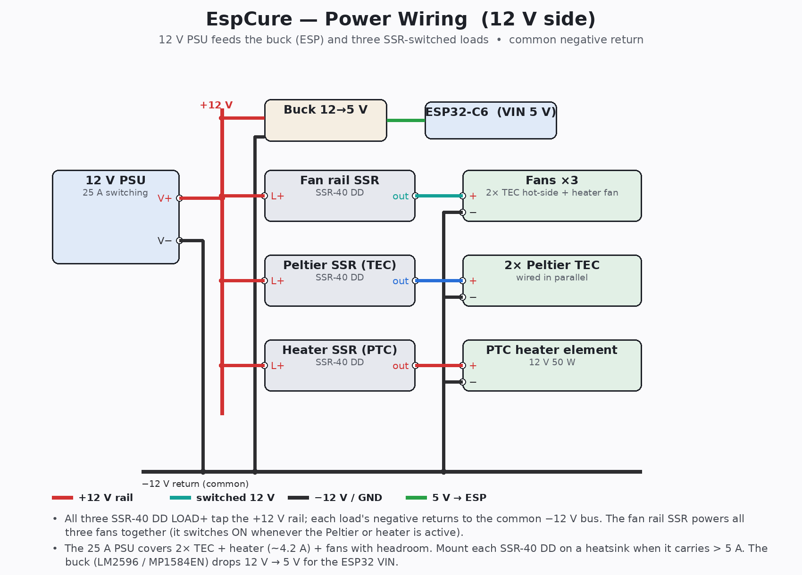

# Hardware

## Bill of Materials

| # | Component | Spec / Part | Notes |
|---|---|---|---|
| 1 | **Fridge** | Honeywell thermoelectric wine cooler | Remove original control board |
| 2 | **MCU** | ESP32-C6 DevKit (e.g. Espressif ESP32-C6-DevKitC-1) | 3.3 V logic; requires ESP-IDF firmware |
| 3 | **Chamber sensor** | SHT45 breakout (Adafruit #5665 or equiv.) **or** SHT31-D (both I²C 0x44) | I²C, 3.3 V. SHT45: ±0.1 °C / ±1 % RH. SHT31: ±0.3 °C / ±2 % RH. Select via the `sht_platform` substitution in `espcure.yaml` — see "Swapping the chamber sensor" below |
| 4 | **SSR — Fan rail** | SSR-40 DD (DC-DC solid-state relay) | Controls all 3 fans together (2 TEC hot-side + heater fan); runs continuously while a cure program is active, else ON when Peltier or heater active |
| 5 | **SSR — Peltier cooling** | SSR-40 DD | Controls both TECs in parallel; LEDC 15 Hz bang-bang (dew point / VPD driven) |
| 6 | **SSR — Heater** | SSR-40 DD | Controls PTC element only (heater fan wired to fan rail); LEDC 15 Hz PID driven |
| 7 | **PTC heater** | 12 V 50 W PTC ceramic heater with integrated 12 V fan, 87.5 × 60 × 42 mm (AliExpress) | Fan and element have **separate connectors** (white JST = fan; bare red/black = PTC element) — no splicing needed |
| 8 | **12 V PSU** | Generic 12 V 300 W switching PSU (25 A) | 25 A headroom covers 2× TECs + heater (4.2 A) + fans comfortably |
| 9 | **Buck converter** | 12 V → 5 V DC-DC buck (e.g. LM2596 or MP1584EN module) | Steps 12 V rail down to 5 V for ESP32 VIN — eliminates the separate 5 V PSU |
| 10 | **OLED display** | SSD1306 0.96" 128×64 I²C OLED (e.g. AliExpress ~$3) | Shares GPIO21/22 I²C bus — no extra wiring beyond VCC/GND |
| 11 | **Misc** | 18 AWG wire, lever nuts (Wago 221), heat shrink, 3× SSR heatsinks | SSR-40 DDs must be mounted on heatsink when carrying > 5 A |

## GPIO Pinout

| GPIO | Function | Notes |
|---|---|---|
| 5 | SSR-40 DD — Fan rail IN | Active HIGH; all 3 fans; continuous while a cure program is active, else on when Peltier or heater active |
| 8 | WS2812 RGB LED | Built into ESP32-C6 DevKitC-1 — no wiring needed |
| 9 | BOOT button (display page cycle) | Built into DevKitC-1 — INPUT_PULLUP, active low |
| 18 | SSR-40 DD — Peltier TEC IN | LEDC 15 Hz; active HIGH; both TECs in parallel; bang-bang driven by dew point/VPD loop |
| 19 | SSR-40 DD — Heater IN | LEDC 15 Hz; active HIGH; PTC element only; driven by heat-only PID |
| 21 | SDA (SHT45 + OLED) | I²C — shared by both devices |
| 22 | SCL (SHT45 + OLED) | I²C — shared by both devices |
| 23 | Unused | (formerly dehumidifier relay; removed) |

> **⚠️ 3.3 V control voltage:** The ESP32-C6 GPIO outputs 3.3 V. SSR-40 DD spec says 3–32 V control, so 3.3 V is at the minimum. Test continuity of each SSR before final install — if an SSR doesn't trigger reliably, add a small NPN transistor (e.g. 2N2222) between the GPIO and SSR input to drive it at a higher current level.

## Wiring Overview

### Chamber sensor (SHT45 / SHT31) — power & I²C

The chamber sensor is a 4-wire I²C device powered from the **ESP32-C6 DevKitC-1's on-board 3.3 V pin** — there is no separate sensor supply. The SSD1306 OLED shares the same four wires in parallel (I²C `0x44` for the SHT, `0x3C` for the OLED — no conflict). Pull-ups live on the SHT breakout, so no external resistors are needed. The SHT31-D and SHT45 use the identical hookup.

| SHT pin | ESP32-C6 pin |
|---|---|
| VIN / VDD | **3V3** (power) |
| GND | GND |
| SDA | GPIO21 |
| SCL | GPIO22 |



> The diagram is generated by `docs/sht_wiring.py` (`python3 docs/sht_wiring.py`). Edit the script and re-run to update `docs/sht_wiring.png`.

### Full system wiring

The rest of the wiring is split into two diagrams — the low-voltage **control** side and the 12 V **power** side.

**Control side** — ESP32-C6 GPIO → the three SSR-40 DD control inputs, the on-board LED/button, and 5 V power in:



**Power side** — 12 V PSU → buck converter (ESP) and the three SSR-switched loads, with a common negative return:



> Both diagrams are generated by `docs/wiring_diagrams.py` (`python3 docs/wiring_diagrams.py`). Edit the script and re-run to regenerate `docs/wiring_control.png` and `docs/wiring_power.png`.

A text version of the full system wiring:

```
                     ┌──────────────────────────────────────┐
                     │        ESP32-C6 DevKitC-1            │
                     │                                      │
  SHT45 SDA ─────────┤ GPIO21 (SDA) ── OLED SDA             │
  SHT45 SCL ─────────┤ GPIO22 (SCL) ── OLED SCL             │
                     │                  GPIO5  ├──── SSR-40 DD (Fan) IN+
                     │                  GPIO8  │ WS2812 RGB LED (built-in)
                     │                  GPIO9  │ BOOT button (built-in)
                     │                  GPIO18 ├──── SSR-40 DD (TEC)  IN+
                     │                  GPIO19 ├──── SSR-40 DD (Heat) IN+
                     │                  GND    ├──── all 3 SSR IN−
                     └──────────────────────────────────────┘

  12V PSU (+) ──── SSR-40 DD (Fan)  LOAD+ ──── TEC fan 1 (+)
               │                          └──── TEC fan 2 (+)
               │                          └──── Heater fan (+)
               │
               ├──── SSR-40 DD (TEC)  LOAD+ ──── TEC 1 (+)
               │                          └──── TEC 2 (+)  [parallel]
               │
               └──── SSR-40 DD (Heat) LOAD+ ──── PTC element (+)

  12V PSU (−) ──── all TEC (−), fan (−), PTC element (−)  [common ground]

  12V PSU (+) ─── Buck converter (12V→5V) ─── ESP32 VIN

  SHT45 VDD ─── 3.3V   SHT45 GND ─── GND
  OLED VCC  ─── 3.3V   OLED GND  ─── GND
```

## OLED Display Wiring

The SSD1306 OLED shares the existing I²C bus — only 4 wires needed:

```
OLED VCC → ESP32 3.3V
OLED GND → ESP32 GND
OLED SDA → GPIO21  (same wire as SHT45 SDA)
OLED SCL → GPIO22  (same wire as SHT45 SCL)
```

The SSD1306 I²C address (0x3C) does not conflict with the SHT45 (0x44). No pull-up resistors are needed if the SHT45 breakout already has them (most do).

For a 1.3" SH1106 OLED, wiring is identical — change `model: "SSD1306 128x64"` to `model: "SH1106 128x64"` in `espcure.yaml`.

## Heater Wiring

The PTC heater has **two separate connectors pre-wired from the factory**:

- **White JST connector** (2 pins, thin wires) → fan. Connect to the 12 V fan rail output (fan SSR GPIO5 load side). Fan runs when PID is active.
- **Bare red/black wires** (thicker) → PTC ceramic element. Connect to the heater SSR output (GPIO19 load side). Element is LEDC 15 Hz controlled.

No cutting or splicing required.

## SSR-40 DD Heatsinking

The SSR-40 DDs must be mounted on aluminum heatsinks when carrying more than ~5 A. Without a heatsink they will overheat and fail. Use M3 screws and thermal paste between the SSR base and the heatsink. A single 100 × 60 mm aluminum plate works for all three SSRs if they're thermally isolated from each other.

## Mounting the SHT45

Mount the SHT45 inside the chamber, away from the Peltier cold plate and out of the direct hot-side fan stream. Ideal position: center-rear of the interior air space, elevated off the floor. The SHT45 has negligible self-heating (~0.1–0.2 °C at 3.3 V) — far less than the SHT31. Still calibrate with an offset after install.

The SHT45 on-chip heater is **off during normal operation** (`heater_max_duty: 0.0`). If condensation forms on the sensor face (humidity reads ~100 % after a rapid temperature drop), press **Clear Sensor Condensation** in HA or the device web UI — it briefly enables the heater for one measurement cycle to evaporate the condensation, then immediately disables it and takes a clean reading. See `docs/calibration.md` for details.

## Swapping the chamber sensor (SHT31 ↔ SHT45)

Both the SHT31-D and SHT45 use I²C address `0x44` and the same 4-wire connection, so the wiring never changes. They differ only in the ESPHome platform (`sht3xd` vs `sht4x`) and the on-chip heater API. The config selects between them with a single substitution at the top of `espcure.yaml`:

```yaml
substitutions:
  sht_platform: sht3xd        # SHT31  (change to sht4x for the SHT45)
```

To swap, change **two** things, then reflash:

1. The `sht_platform` substitution (`sht3xd` = SHT31, `sht4x` = SHT45).
2. The **Clear Sensor Condensation** button lambda — the heater API differs (`set_heater_enabled(bool)` on the SHT31, `set_heater_max_duty(float)` on the SHT45). Both versions are kept in the button's `on_press` block; comment out one and uncomment the other.

Run `esphome config espcure.yaml`, then `esphome run espcure.yaml`. Because the SHT31 has higher self-heating than the SHT45, **re-measure the calibration offset** after swapping (see `docs/calibration.md`).

## Dehumidification

The Peltier cold plate is the sole dehumidification mechanism. When the dew-point or VPD control loop is active, the Peltier condenses moisture from the chamber air by pulling the cold plate temperature below the air's dew point. There is no external dehumidifier relay.

## Frost Protection (Software-Only)

There is no cold-plate temperature sensor in this build. Frost protection is handled in firmware: if the chamber air temperature (SHT45) drops below the **Min Chamber Temperature** setpoint (default 4 °C), the Peltier is suspended until the chamber recovers 2 °C above that floor. The heater continues running during frost to aid recovery. Adjust the floor in HA under the **Min Chamber Temperature** number entity.

Note: without a cold-plate sensor, the protection reacts to chamber air temperature rather than the Peltier surface directly. If you observe ice forming on the Peltier fins, raise the Min Chamber Temperature setpoint.

## Temperature Safety Ceiling

A **Max Chamber Temperature** number entity (default 27 °C, user-adjustable 22–32 °C) forces the Peltier cooling ON above the ceiling regardless of humidity demand. This gives temperature an emergency downward authority. In normal operation (17–19 °C), this ceiling never activates.

## Original Control Board Removal

1. Unplug the fridge. Wait 30 s.
2. Remove the back panel and locate the PCB connected to the Peltier wires.
3. Disconnect the Peltier wiring harness and temperature sensor from the PCB.
4. Disconnect the fan wiring.
5. Remove the PCB entirely. Do not cut Peltier wires — desolder or use lever nuts.
6. Note Peltier polarity before disconnecting (mark wires with tape).

## Fusing

Add an automotive blade fuse holder on the 12 V positive rail:
- Peltier branch: 15 A fuse
- Heater + fan branch: 5 A fuse
- Total 12 V main: match your PSU rating (e.g. 25 A for the 300 W supply in the BOM, or ~8 A for a 100 W Mean Well LRS-100-12)
